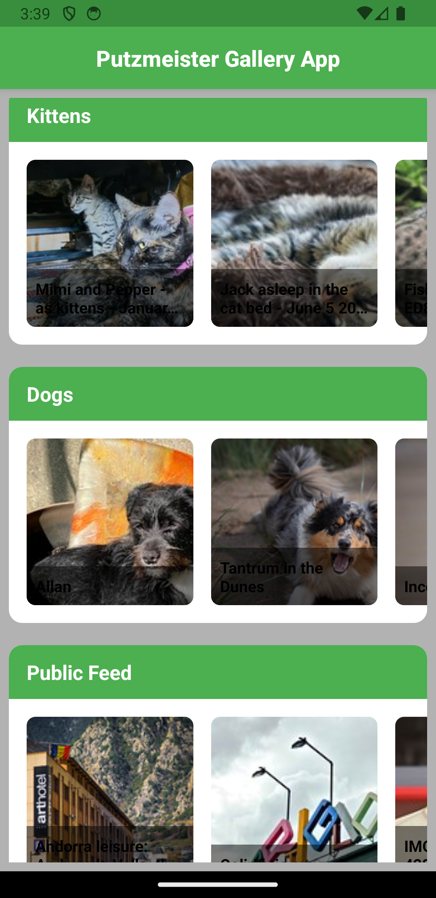
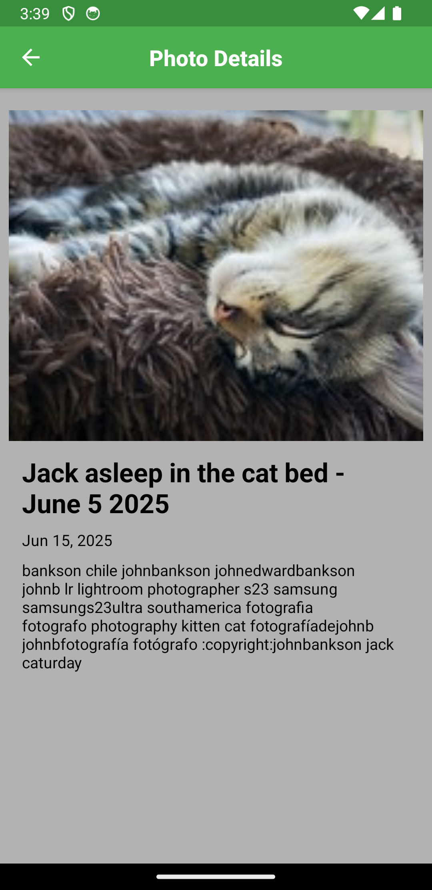

# Putzmeister Flickr Gallery App

A React Native app that fetches and displays images from the Flickr public feed using tags like `dog`, `kitten`, etc.

## 🚀 Features

- Fetch photos from Flickr public feed
- Filter by tags (e.g., `kitten,dog`)
- Grid/List view of images
- React Native + TypeScript

## 📱 Screenshots




## 🛠️ Tech Stack

- React Native
- TypeScript
- Axios
- Flickr API

## 🔧 Setup Instructions

```bash
git clone https://github.com/veeraYazhi/PutzmeisterGallery.git
cd PutzmeisterGallery
npm install
npx react-native run-android   # or run-ios
